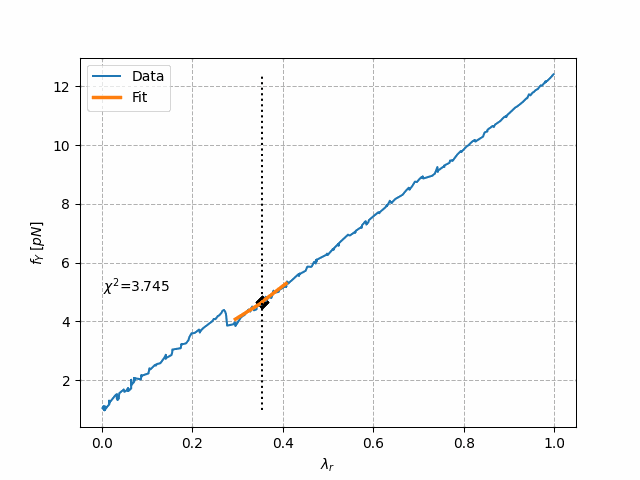
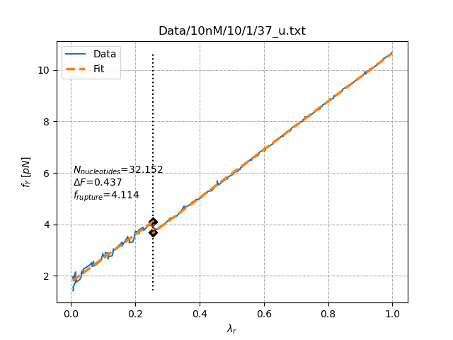
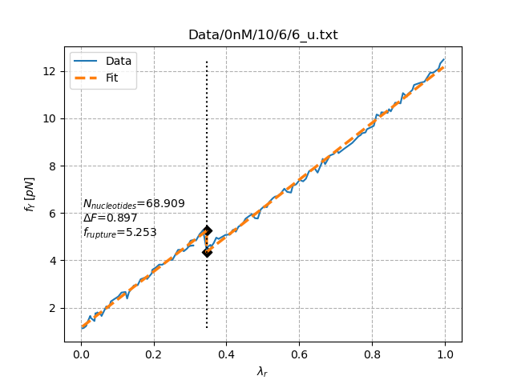

# FluctuationTheorem: Automated Analysis of DNA Hairpin Pulling Experiments

This repository contains a Python framework for the automated preprocessing, analysis, and interpretation of single-molecule pulling experiments on DNA hairpins acquired with optical tweezers.  
The library has been developed to identify unfolding/folding *rip* events, quantify the associated mechanical observables, and extract physically-meaningful parameters such as rupture forces, contour length changes, and the number of nucleotides involved in the transition.

The project integrates several detection algorithms, manual classification tools, and high-level routines for batch analysis of entire datasets.

---

## Table of Contents
1. [Requirements and Installation](#requirements-and-installation)
2. [Overview](#overview)  
3. [Core Functionalities](#core-functionalities)  
4. [Rip Detection Algorithms](#rip-detection-algorithms)  
5. [Physical Parameter Extraction](#physical-parameter-extraction)  
6. [Workflow Example](#workflow-example)  
7. [Demonstration GIF](#demonstration-gif)  
8. [Example Rip Events](#example-rip-events)  
9. [Output Structure](#output-structure)  
10. [References](#references)  
11. [Authors](#authors)

---

## Requirements and Installation

To install required dependencies:

```bash
pip install -r requirements.txt
```

---

## Overview

The central component of the package is the `Txt_Reading` class, which provides:

- robust parsing of raw `.txt` trajectory files generated by optical tweezers acquisition systems;  
- normalization and preprocessing of force–extension traces;  
- automated detection of rupture events (*rip* identification);  
- linear fits of pre- and post-rupture branches;  
- extraction of key biophysical indicators, including rupture force, stiffness, and number of released nucleotides.

The framework is designed to support high-throughput analysis and includes manual verification utilities to ensure accuracy even in low signal-to-noise conditions.  

---

## Core Functionalities

### **1. Parsing & Normalization**
Raw data are loaded and filtered to retain only high-frequency entries (100 kHz acquisition bandwidth).  
The extension coordinate λ is normalized to `[0, 1]`, while force values are optionally reshaped using mean or median filters.

Relevant implementation:  
`analysis.py`, class `Txt_Reading`  
(see `readTxt()` and `_only_readTxt()`)

---

### **2. Automated Rip Detection**

Two independent algorithms are implemented:

#### **Method 2 (χ²-minimization strategy)**
- Multi-scale reshaping of the trajectory (1–20 points).  
- Piecewise-linear fitting around candidate transitions.  
- Selection of the best solution via:
  - minimum χ²,
  - physically reasonable ΔF,
  - consistency of the rupture position.

Reference:  
`rip_founder.py`, class `method2`

#### **Method 2 – New (ΔF-maximization strategy)**
- Median reshaping with fixed window (r ≈ 10).  
- Peak detection on the discrete derivative (ΔF/Δλ).  
- Selection of the best rip as the one maximizing ΔF under physical constraints.

Reference:  
`rip_founder_new.py`, class `method2_new`

Both methods output:
- rupture force $f_r$ 
- post-rupture force $f_{r,\text{next}}$  
- ΔF  
- λ₀ (transition point)  
- linear fits before/after the rip  
- diagnostic $\chi^2$  
- a reconstructed theoretical force curve

---

### **3. Physical Parameter Extraction**

From the fitted segments and the WLC model, the library estimates:

- **Effective stiffness** $k_{\text{eff}}$
- **Released ssDNA length**  
- **Number of nucleotides** using:  

$$N = \frac{x_{\text{ssDNA}}}{x_{\text{WLC}}(f_r)\,d_{\text{aa}}}$$

- **Transition time** $t_0$

Reference:  
`analysis.py :: _compute_interesting_variables`

---

## Workflow Example

```python
from analysis import Txt_Reading

# Initialize reader for 10 nM DNA hairpin dataset (max force ≈ 10 pN)
reader = Txt_Reading(folder="10nM", f_MAX=10)

# Load and analyze the first unfolding cycle of molecule 37
data = reader.readTxt(
    number=37,
    N=1,
    ty='u',        # 'u' = unfolding, 'f' = folding
    graph=True     # produces diagnostic plot
)

print("Rupture force:", reader.f_rupture)
print("Nucleotides:", reader.N_nucleotides)
```

### Demonstration GIF

Below is a short GIF showing the step-by-step evaluation of $\chi^2$ across candidate rupture points:
<p align="center">
  
</p>

### Example Rip Events
Folding at high concentration (10 nM) and Unfolding at low concentration (0 nM)
<p align="center">
  
  
</p>

### Output Structure

During the sequential analysis (sequential_analysis()), the software exports several products:

```bash
Data/<folder>/<f_MAX>/<molecule>/<cycle>_<type>.txt
meta/<folder>/<f_MAX>/{jumps, linear, trash, unknown}.txt
saved/                  # reliably-detected rip events
saved/linear/           # trajectories without rip
not_saved/              # trajectories discarded for quality

```

The meta files allow resuming the manual classification of uncertain traces and ensure reproducibility across sessions.

## References

* Bustamante et al., Single-molecule studies of DNA mechanics, Nature (2003)

* Woodside et al., Direct measurement of folding landscapes via optical tweezers, Science (2006)

* WLC Model: Marko & Siggia, Macromolecules (1995)

## Authors
* Annamaria Zaltron 
* Xavier Viader Godoy
* Riccardo Tancredi 

Department of Physics & Astronomy, University of Padua
Optical Tweezers DNA Mechanics Project (2022–2024)

For questions or collaboration opportunities, please contact:
riccardo.tancredi@studenti.unipd.it